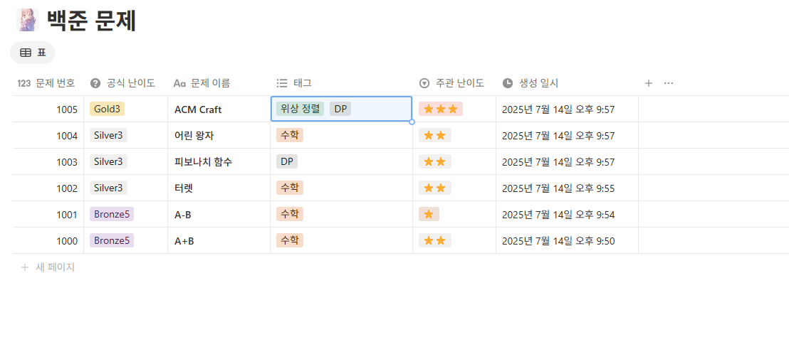

# Baekjoon Problem Manager

VS Code에서 백준 문제를 효율적으로 정리하고, Notion에 자동으로 풀이를 백업할 수 있는 확장입니다.




## 주요 기능

- 백준 문제를 **난이도별 폴더 구조**로 정리
- VS Code에서 문제 파일을 자동으로 탐색 및 열기
- 현재 에디터의 코드 내용을 **Notion에 전송**
- Python / C++ / Java / Javascript 등 주요 언어 지원
- 단축키로 빠르게 문제 풀이 백업

##  폴더 구조 예시

```
coding-challenges/
├── Bronze/
│ └── baekjoon_1000/
│   │   solution1.py
│   └── solution2.py
├── Silver/
│ └── baekjoon_1002/
│   │   solution1.java
│   └── solution2.js
└──────────────
```

## 단축키

| 동작 | 단축키 | 설명 |
|------|--------|------|
| 파이썬 파일 만들기 | `Ctrl + Alt + p` | 문제 번호를 입력하고 폴더와 파이썬 파일을 만듬 |
| 노션에 업로드 | `Ctrl + Alt + N` | 에디터 떠 있는 문제를 Notion에 업로드 |


##  설정

확장 설정은 VS Code Settings에서 다음과 같이 구성되어 있습니다:

| 설정 키 | 설명 |
|---------|------|
| `baekjoon-manage.enableNotionFeature` |노션 확장 기능 활성화|
| `baekjoon-manage.database_id` | Notion 데이터베이스 ID |
| `baekjoon-manage.manageTags` | 문제 유형을 관리 / 기타(직접 입력) 은 필수입니다 |

## 사용법

1. 이 확장을 설치합니다.
2. 노션 토큰, 페이지 id 를 입력 합니다.
3. `Ctrl + Alt + p` 를 눌러 문제 번호를 입력합니다.
4. 문제를 다 풀었으면 `Ctrl + Alt + N` 를 눌러 노션에 업로드합니다.


##  기여하기

기능 제안, 버그 제보, 코드 개선 등 모든 기여를 환영합니다.  
Pull Request 또는 Issue로 자유롭게 참여해주세요!